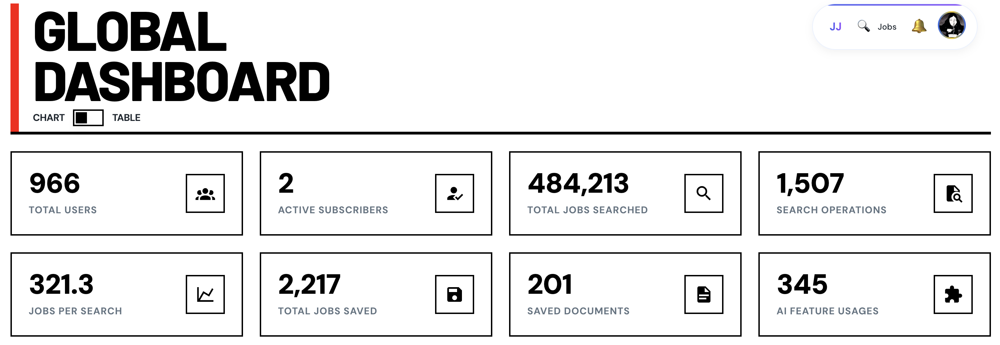

<div align="center">


# JobJourney Assistant
### The Ultimate AI-Powered Job Search Companion

[](https://github.com/Rorogogogo/Jobjourney-extention/stargazers)
[](LICENSE)
[](https://chromewebstore.google.com/detail/jobjourney-assistant/YOUR_EXTENSION_ID)


<br/>

**Supercharge your job hunt with intelligent automation.**
JobJourney Assistant seamlessly integrates with your browser to scrape, track, and organize job listings from LinkedIn, Indeed, SEEK, and more—all in one place.

<br/>



<br/>

[**Explore JobJourney Platform »**](https://jobjourney.me) · [Report Bug](https://github.com/Rorogogogo/Jobjourney-extention/issues) · [Request Feature](https://github.com/Rorogogogo/Jobjourney-extention/issues)

</div>

## ⚠️ Important Disclaimers & Responsible Use

This extension utilizes web scraping techniques to collect publicly available information from job listing websites. Users must understand and agree to the following conditions:

- **Purpose of Use**: This tool is intended strictly for personal, non-commercial use to assist individual job searching efforts and for educational purposes related to web technologies and scraping techniques.
- **Commercial Use Prohibited**: Any use of this extension for commercial purposes, data resale, or any activity beyond personal job seeking and technical study is strictly prohibited.
- **Compliance with Terms of Service**: Users are solely responsible for ensuring their use of this extension complies with the terms of service of the websites they scrape (e.g., LinkedIn, Indeed, SEEK).
- **Rate Limiting & Ethical Use**: Use the search function thoughtfully; avoid excessively frequent searches. Treat the tool as a helper for your normal browsing habits, not a high-speed data harvesting engine.
- **No Liability**: This extension is provided "as is" without warranty of any kind. Users bear full responsibility for their use of the extension.

By using this extension, you acknowledge and agree to these terms and responsibilities.

## ✨ Key Features

### 🌐 Multi-Platform Intelligence
Automatically detects and extracts job data from major platforms:
- **LinkedIn** (Global)
- **Indeed** (Global)
- **SEEK** (Australia & New Zealand)
- **Reed** (UK)
- **JobJourney** (Native Integration)

### 📊 Smart Data Extraction
Instantly captures critical details with high precision:
- 🏢 **Company & Role**: Job Title, Company Name, Logo
- 📍 **Location**: City, State, Remote/Hybrid status
- 💰 **Compensation**: Salary ranges (when available)
- 📝 **Details**: Full job description, posted date, job type
- 🔗 **Source**: Direct links to original postings

### 🚀 Seamless Workflow
- **Side Panel Power**: Search and view results without leaving your current tab
- **One-Click Save**: Add jobs to your JobJourney dashboard instantly
- **Real-Time Sync**: Authentication and data syncs automatically with the web app
- **Smart Notifications**: Get alerted when important actions occur

## 📦 Installation

### Prerequisites
- Chrome-based browser (Chrome, Edge, Brave, etc.)
- Node.js and pnpm (for development builds)

### Quick Setup
1. **Download**: Clone or download this repository
2. **Enable Developer Mode**: Navigate to `chrome://extensions/` and toggle "Developer mode"
3. **Load Extension**: Click "Load unpacked" and select the `dist` directory
4. **Pin Extension**: Pin the JobJourney extension icon to your toolbar for easy access

### Development Setup
```bash
# Clone the repository
git clone https://github.com/your-repo/jobjourney-extension.git
cd jobjourney-extension

# Install dependencies
npm install -g pnpm
pnpm install

# Development build (includes localhost permissions)
pnpm manifest:dev
pnpm dev

# Production build (Chrome Web Store ready)
pnpm manifest:prod
pnpm build

# Create distribution zip
pnpm build && pnpm zip
```

## 🎯 How to Use

1. **Open the Panel**: Click the JobJourney extension icon in your browser toolbar
2. **Configure Search**:
   - Enter your desired job title or keywords
   - Select target country and specific location
   - Choose job platforms (LinkedIn, Indeed, SEEK) using checkboxes
3. **Initiate Search**: Click "Search" and confirm responsible usage
4. **View Results**: Scraped jobs appear in the panel as they're found
5. **Interact with Jobs**:
   - Click "View Job" to open the original posting
   - Use "Show in JobJourney" to manage jobs in the main platform

## 🏗️ Architecture Overview

### Background Service Worker
Service-oriented architecture with dependency injection:
- **BackgroundService**: Main orchestrator
- **AuthService**: Authentication state and token management
- **ScrapingService**: Job scraping coordination
- **ApiService**: JobJourney API communications
- **StorageService**: Chrome storage abstraction
- **EventManager**: Internal pub/sub system

### Content Scripts
- Event-driven authentication monitoring
- Smart toast notification system with deduplication
- Platform-specific job data extraction
- Extension-to-frontend communication

### Environment Management
Two distinct environments with automatic manifest switching:

#### Development Environment
```bash
pnpm manifest:dev  # Switch to development manifest
pnpm dev          # Build with localhost permissions
```
- Includes localhost permissions for development servers
- Named "JobJourney Assistant (Dev)"

#### Production Environment
```bash
pnpm manifest:prod # Switch to production manifest
pnpm build        # Chrome Web Store ready build
```
- Chrome Web Store compliant
- Named "JobJourney Assistant"

## 🛠️ Development Commands

### Environment Management
```bash
pnpm manifest:dev    # Switch to development manifest
pnpm manifest:prod   # Switch to production manifest
```

### Building & Development
```bash
pnpm dev            # Development mode (Chrome)
pnpm dev:firefox    # Development mode (Firefox)
pnpm build          # Production build (Chrome)
pnpm build:firefox  # Production build (Firefox)
pnpm build && pnpm zip  # Create Chrome Web Store zip
```

### Code Quality
```bash
pnpm lint          # Run linting
pnpm lint:fix      # Fix linting issues
pnpm format        # Format code
pnpm type-check    # Type checking
```

### Testing & Management
```bash
pnpm e2e           # End-to-end tests
pnpm module-manager # Enable/disable modules
pnpm clean:bundle && pnpm build # Clean rebuild
```

## 🔒 Privacy & Security

- Extension operates locally within your browser
- Only activates scraping functions on supported job board websites
- Scrapes publicly available job listing data only
- No private user account information accessed beyond JobJourney integration
- Network requests limited to job sites and JobJourney backend

## 🤝 Contributing

Contributions are welcome! Please follow these steps:

1. Fork the repository
2. Create a feature branch
3. Make your changes and test thoroughly
4. Create a Pull Request with detailed description

### Development Prerequisites
- Chrome-based browser for testing
- Node.js 18+ and pnpm
- Basic understanding of Chrome Extension APIs (Manifest V3)
- Familiarity with React, TypeScript, and Vite

## 📄 License

This project is licensed under the MIT License - see the [LICENSE](LICENSE) file for details.

## 🆘 Support

For questions, bug reports, or feature requests:
- **GitHub Issues**: [Create an Issue](https://github.com/Rorogogogo/Jobjourney-extention/issues)
- **Email**: jobjourney.au@gmail.com

## 🙏 Acknowledgments

- Built with ❤️ for job seekers and tech enthusiasts
- Thanks to all contributors and the open-source community
- Based on the Chrome Extension Boilerplate with React + Vite + TypeScript

---

## 🌟 Support the Project

If you find JobJourney Assistant helpful, please consider giving it a **Star**! ⭐️

It helps more job seekers find this tool and motivates us to keep improving.

[**Star this repository**](https://github.com/Rorogogogo/Jobjourney-extention/stargazers)

---

**Disclaimer**: This extension is designed for personal job searching assistance and educational purposes. Please use responsibly and in compliance with job site terms of service.